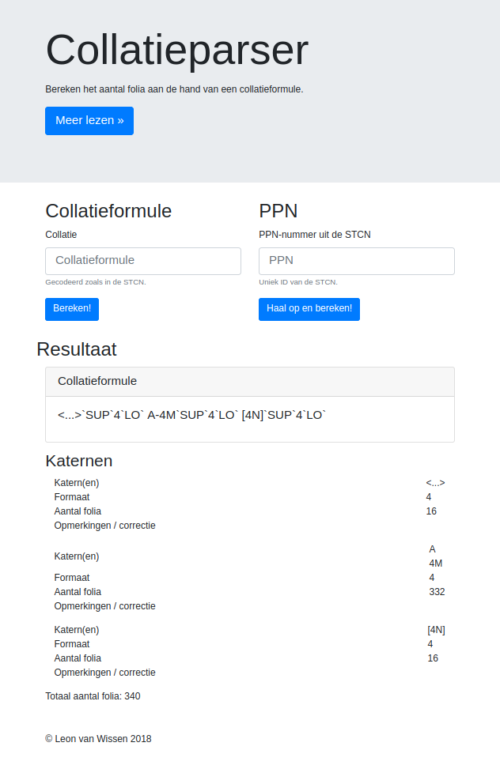

# collatieparser-docker
###### Docker flask implementation around [lvanwissen/CollationParser](https://github.com/LvanWissen/CollationParser)

Online [demo](https://leonvanwissen.nl/tools/collatieparser/).

