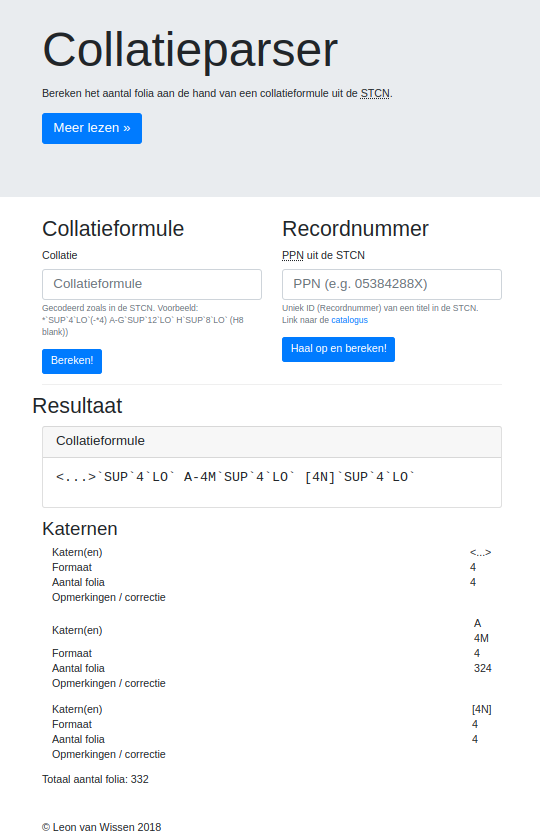

# collatieparser-docker
###### Docker flask implementation around [lvanwissen/CollationParser](https://github.com/LvanWissen/CollationParser)

Online [demo](https://leonvanwissen.nl/tools/collatieparser/).



## How to use

Run:

```bash
docker pull lvanwissen/collatieparser
```

then:
```bash
docker run -p 5000:5000 --name collatieparser lvanwissen/collatieparser
```

NB: host port (-p host:container in the above line) and container name can be changed. An internet connection (for your containers) is required  in order to fetch collate formulas from the STCN. 

## Questions / bugs?
[E-mail](mailto:leon@vwissen.nl)!